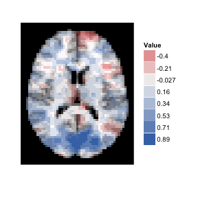
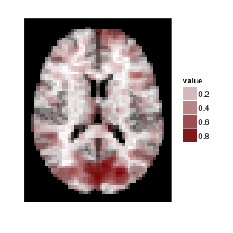
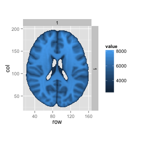
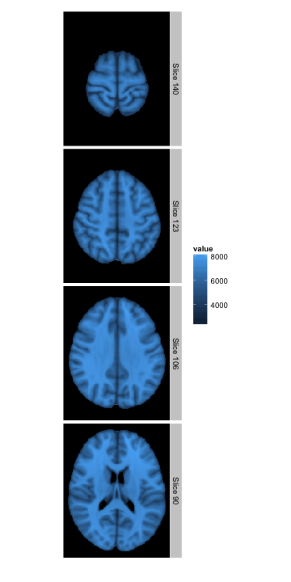
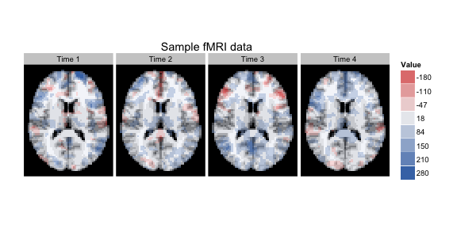
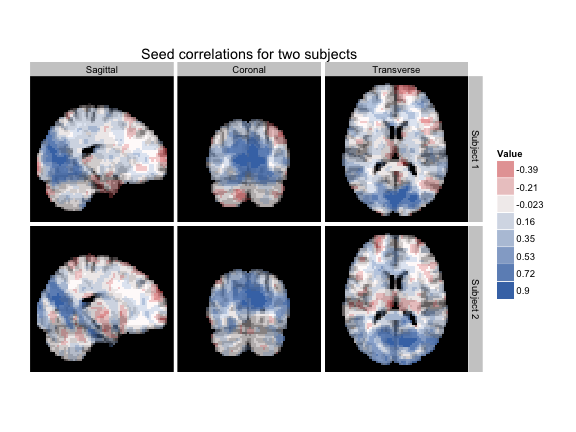
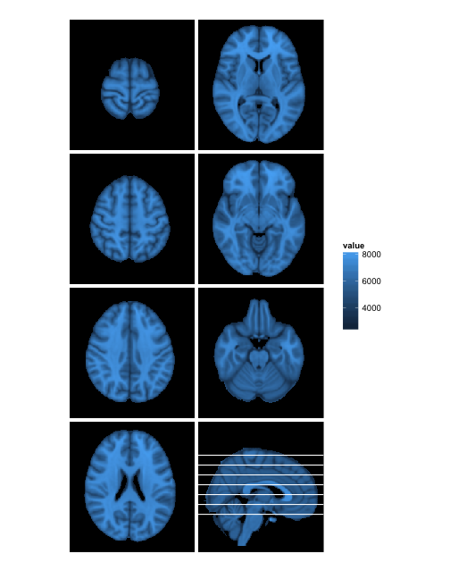
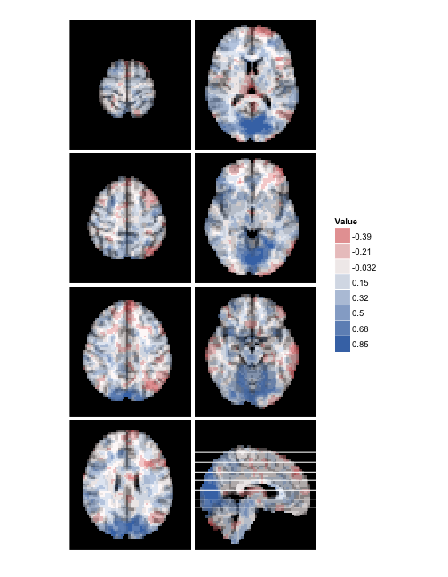
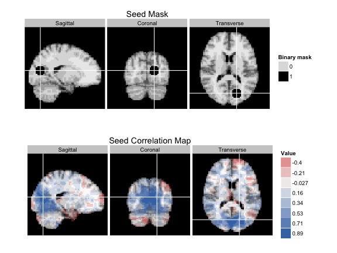

<!--
%\VignetteEngine{knitr::knitr}
%\VignetteIndexEntry{Introduction to the ggBrain Package}
-->


# Introduction to the ggBrain Package


## Introduction 

The *ggBrain* package converts 3-D or 4-D brain image arrays to "long" data frames, which are then converted in *ggplot* objects. Users can create multi-panel figures showing several slices from  several brains. Within each panel, either structural images can be displayed, or voxelwise statistics (i.e. seed correlations or p-values) can be displayed on top of a template.

Of the functions available in this package, the `ggBrain` function requires the least input from the user. `ggBrain` and generates *ggplot* objects for displaying brain images. For further customization of brain image figures, the `getBrainFrame` function can be used to generate long data frames based on 3-D or 4-D brain image arrays. These data frames include variables that can be used for faceting images in multi-panel displays. Note, within the *ggBrain* package, the `ggBrain` function makes several calls to `getFrameBrain`.

The `ggBrain` function also has a special option for "<a href='#tri-planar'>Tri-Planar</a>" figures, where one slice is shown for each of the 3 margins of a 3-D image. In these figures, cross-hairs are generated to show the spacial correspondence between the three panels.

Finally, the package contains a handful of *ggplot* theme functions, for changing the background to be black, and for removing irrelevant labels. 

Note, because *ggplot* generally requires that variables mapped to the same aesthetic dimension be plotted on the same scale, it can be a challange to plot both a template image and a voxelwise statistic image in the same figure. *ggBrain* essentially handles this by hard-coding the coloring of the template image, without actually mapping the template `fill` to any variable.

The remainder of this vignette provides example code for <a href='#single-panel'>basic image figures</a> with just one slice, <a href='#multi-panel'>multi-panel</a> figures, and <a href='#tri-planar'>tri-planar</a> figures.


##  <a name="single-panel"> Single-panel figures</a>

Before beginning our basic examples, we'll load brain images for use in the remainder of this vignette. 


```r
# Loading data for use in all examples

library(oro.nifti)  #for opening nii.gz files
```

```
## 
## oro.nifti: Rigorous - NIfTI+ANALYZE+AFNI Input / Output (version = 0.4.0)
```

```r

s_map1 <- readNIfTI(system.file("seed_corr_1.nii.gz", package = "ggBrain"))
s_map2 <- readNIfTI(system.file("seed_corr_2.nii.gz", package = "ggBrain"))
template <- readNIfTI(system.file("template.nii.gz", package = "ggBrain"))
mask <- readNIfTI(system.file("brain_mask.nii.gz", package = "ggBrain"))
seed_mask <- readNIfTI(system.file("seed_mask.nii.gz", package = "ggBrain"))
nii1_trunc <- readNIfTI(system.file("subj_trunc_1.nii.gz", package = "ggBrain"))


# get high definition brain image from the brainR package
if (require(brainR)) {
    hd_template <- readNIfTI(system.file("MNI152_T1_1mm_brain.nii.gz", package = "brainR"))
}
```

```
## Loading required package: brainR
## Loading required package: rgl
## Loading required package: misc3d
```

```r

library(ggBrain)
library(ggplot2)
```


To create a single-slice plot of a structural brain image (i.e. MRI, as opposed to fMRI), set the `type` argument of `ggBrain` to `'structural'`.


```r

dd <- ggBrain(brains = hd_template, mask = hd_template > 0, mar = 3, mar_ind = 93, 
    type = "structural")
# now add aethetic changes with conventional ggplot code.
dd + scale_fill_continuous(low = "black", high = "white") + theme_black_bg()  # we include the theme_black_bg() as an aesthetic preference.
```

 


Above, the `mar=3` argument tells that the transverse plane should be used, as opposed to the saggital or coronal planes. The `mar_ind` argument tells the slice number to plot.

Voxelwise statistics can also be plotted on top of a template image. If the voxelwise statistic can be both positive and negative (i.e. seed correlation images), users should set `type=signed`.


```r
# s_map1 is a seed correlation image, based on correlation with the region
# denoted by seed_mask
dd <- ggBrain(template = template, brains = s_map1, mask = mask, mar = 3, mar_ind = 30, 
    type = "signed")

dd + scale_alpha(range = c(0, 1)) + labs(fill = "Sign", alpha = "Magnitude\n(opacity)") + 
    theme_black_bg()
```

 


For voxelwise statistics are all positive (i.e., p-values), the `type` argument should be set to `'positive'`. As an example here we simply take the absolute value of the seed correlation image, but a p-value map could also be displayed.


```r
dd <- ggBrain(template = template, brains = abs(s_map1), mask = mask, mar = 3, 
    mar_ind = 30, type = "positive")

dd + scale_alpha(range = c(0, 1)) + labs(fill = "Sign", alpha = "Magnitude\n(opacity)") + 
    theme_black_bg()
```

 


If no template is specified, values are plotted against a pure white version of the mask.


```r
dd <- ggBrain(brains = abs(s_map1), mask = mask, mar = 3, mar_ind = 30, type = "positive")

dd + scale_alpha(range = c(0, 1)) + labs(fill = "Sign", alpha = "Magnitude\n(opacity)") + 
    theme_black_bg()
```

 


For users more familiar with *ggplot*, the `getBrainFrame` function can be used to generate a data frames for use in *ggplot* objects. This can allows more control over plotting choices, but also requires more input from the user.


```r
bf <- getBrainFrame(brains = hd_template, mar = 3, mar_ind = 93, mask = hd_template > 
    0, center_coords = FALSE)
head(bf)
```

```
##   value row col row_ind col_ind
## 1  3409  97  26       1       1
## 2  3877  98  26       1       1
## 3  4258  99  26       1       1
## 4  4530 100  26       1       1
## 5  4710 101  26       1       1
## 6  4782 102  26       1       1
```

```r

ggplot() + geom_tile(data = bf, aes(x = row, y = col, fill = value)) + facet_grid(row_ind ~ 
    col_ind) + coord_fixed(ratio = 1)
```

 


## <a name="multi-panel"> Multi-panel brain figures</a>

For multipanel images, either `ggBrain` or `getBrainFrame` require the input of several vectors: `mar`, `mar_ind`, `col_ind`, `row_ind`. All of these vectors should be of the same length. This length will be equal to the number of panels in the final figure. 

For each panel, `mar` denotes which margin of the brain image we should slice over, `mar_ind` denotes the slice number, and `row_ind` and `col_ind` denote the position of the panel within the overall figure. This layout convention allows for several types of images to be contructed, such as <a href='#tri-planar'>tri-planar</a> figures and comparisons of images from different subjects.

As a basic example, suppose we wish to show four transverse slices from a single subject's brain image.


```r
dd <- ggBrain(hd_template, mask = hd_template > 0, mar = c(3, 3, 3, 3), mar_ind = floor(seq(140, 
    90, length = 4)), col_ind = c(1, 1, 1, 1), row_ind = c(1, 2, 3, 4), type = "structural")

dd + theme_black_bg()
```

 


Above, setting `row_ind=c(1,2,3,4)` causes the images to be plotted on top of each other.

Alternatively, we can use the `time` argument to plot different images taken during the course of an fMRI


```r
dd <- ggBrain(brains = nii1_trunc, template = template, mask = mask, mar = rep(3, 
    4), mar_ind = rep(30, 4), row_ind = rep(1, 4), col_ind = paste("time", 1:4), 
    time = 1:4)

dd + theme_black_bg() + labs(fill = "Sign", alpha = "Magnitude\n(opacity)", 
    title = "Sample fMRI data") + scale_alpha(range = c(0, 1))
```

 


We can also use the `brain_ind` argument to show two seed correlation images from two different subjects. Changing the `mar` vector lets us to show different slices for each subject. Note, these correlation images are on the same scale.


```r
dd <- ggBrain(brains = list(s_map1, s_map2), brain_ind = c(1, 1, 1, 2, 2, 2), 
    template = template, mar = c(1, 2, 3, 1, 2, 3), mar_ind = c(37, 18, 30, 
        37, 18, 30), row_ind = c("Subject 1", "Subject 1", "Subject 1", "Subject 2", 
        "Subject 2", "Subject 2"), col_ind = factor(c(1, 2, 3, 1, 2, 3), labels = c("Saggital", 
        "Coronal", "Transverse")), mask = mask)
dd + scale_alpha(range = c(0, 1)) + labs(fill = "Sign", alpha = "Magnitude\n(opacity)") + 
    ggtitle("Seed correlations for two subjects") + theme_black_bg()
```

 


The `lines_mat` argument can be used to add a key to multipanel plots.  This argument should contain a matrix with 3 columns, and one row for each line to be added to the figure. Each row of `lines_mat` should contain a triplet of values, with the first element telling which panel the line should be placed in, the second element containing the margin to plot over, and the third element telling the slice index where the line should be placed.


```r
mar = c(3, 3, 3, 3, 3, 3, 3, 1)
mar_ind = c(floor(seq(140, 50, length = 7)), 88)
col_ind = c(1, 1, 1, 1, 2, 2, 2, 2)
row_ind = c(1, 2, 3, 4, 1, 2, 3, 4)
lines_mat <- cbind(panel = 8, mar, mar_ind)[1:7, ]

lines_mat
```

```
##      panel mar mar_ind
## [1,]     8   3     140
## [2,]     8   3     125
## [3,]     8   3     110
## [4,]     8   3      95
## [5,]     8   3      80
## [6,]     8   3      65
## [7,]     8   3      50
```

```r

dd <- ggBrain(brains = hd_template, mar = mar, mar_ind = mar_ind, row_ind = row_ind, 
    col_ind = col_ind, mask = hd_template > 0, type = "structural", lines_mat = lines_mat)

dd + theme_black_bg()
```

 


These types of plots can also be created for voxelwise statistics


```r
mar_ind = c(floor(seq(48, 20, length = 7)), 30)  #reduce dimensions
# to match fMRI data
lines_mat <- cbind(panel = 8, mar, mar_ind)[1:7, ]

dd <- ggBrain(brains = s_map1, template = template, mar = mar, mar_ind = mar_ind, 
    row_ind = row_ind, col_ind = col_ind, mask = mask, lines_mat = lines_mat)

dd + labs(fill = "Sign", alpha = "Magnitude\n(opacity)") + scale_alpha(range = c(0, 
    1)) + theme_black_bg()
```

 


###  <a name="tri-planar"> Tri-planar figures </a>

For plots with three panels, each showing a different margin of the brain image, the `tri_planar` argument can be used to create cross-hairs that show correspondance across the images.


```r
dd <- ggBrain(brains = s_map1, template = template, mar = c(1, 2, 3), mar_ind = c(37, 
    18, 30), row_ind = c(1, 1, 2), col_ind = c(2, 1, 1), tri_planar = TRUE, 
    lines_color = "black", mask = mask)
dd + scale_alpha(range = c(0, 1)) + labs(fill = "Sign", alpha = "Magnitude\n(opacity)")
```

 


In the example below, we show the seed mask and the seed correlation map from an example subject. Since these are on different scales, they shouldn't be combined into one *ggplot* object. Instead, we use `grid.arrange` to display them separately.


```r
mar = c(1, 2, 3)
col_ind = factor(c(1, 2, 3), labels = c("Saggital", "Coronal", "Transverse"))
row_ind = c(1, 1, 1)
mar_ind = c(37, 18, 30)

dd_mask <- ggBrain(brains = seed_mask, template = template, mar = mar, mar_ind = mar_ind, 
    row_ind = row_ind, col_ind = col_ind, type = "binary", binary_color = "black", 
    tri_planar = TRUE, mask = mask) + labs(alpha = "Binary mask", title = "Seed Mask") + 
    theme_black_bg()


dd_1 <- ggBrain(brains = s_map1, template = template, mar = mar, mar_ind = mar_ind, 
    row_ind = row_ind, col_ind = col_ind, tri_planar = TRUE, mask = mask) + 
    scale_alpha(range = c(0, 1)) + labs(fill = "Sign", alpha = "Magnitude\n(opacity)", 
    title = "Seed Correlation Map") + theme_black_bg()

library(gridExtra)
```

```
## Loading required package: grid
```

```r
grid.arrange(dd_mask, dd_1)
```

 


